# Nexora HRMS — Process Flows

This document walks through every major business process in the HRMS, with proper flowcharts, sequence diagrams, state diagrams, and step-by-step explanations. The final section answers the question of how the **Admin/HR** themselves are handled (since every role is also an Employee).

> **Diagrams use Mermaid.** They render natively in GitHub, GitLab, VS Code (Mermaid extension), Notion, Obsidian, and most modern markdown viewers.
>
> **Diagram conventions:**
> - **Stadium** `( … )` — Start / End
> - **Rectangle** `[ … ]` — Process step
> - **Diamond** `{ … }` — Decision
> - **Parallelogram** `[/…/]` — Input / Output
> - **Hexagon** `{{ … }}` — System action
> - **Cylinder** `[( … )]` — Persisted record
> - **Colour coding:** mint = employee action · forest = admin · emerald = manager · umber = system · crimson = error / block · sage = neutral

---

## Table of Contents

1. [Role Model — "Every Role Is An Employee"](#1-role-model--every-role-is-an-employee)
2. [Employee Registration & Onboarding](#2-employee-registration--onboarding)
3. [Daily Attendance](#3-daily-attendance)
4. [Leave Management](#4-leave-management)
5. [Monthly Payroll](#5-monthly-payroll)
6. [Performance Reviews — Half-Yearly Cycles](#6-performance-reviews--half-yearly-cycles)
7. [Admin Self-Service — How HR Handles HR](#7-admin-self-service--how-hr-handles-hr)
8. [Edge Cases & Operational Rules](#8-edge-cases--operational-rules)
9. [Notifications](#9-notifications)
10. [Account Access — First Login & Forgot Password](#10-account-access--first-login--forgot-password)
11. [Audit Log](#11-audit-log)

---

## 1. Role Model — "Every Role Is An Employee"

Four roles exist in the system. Each Manager, PayrollOfficer, and Admin sits on top of an underlying **Employee record** and is subject to the same leave, attendance, and payroll rules (BL-004).

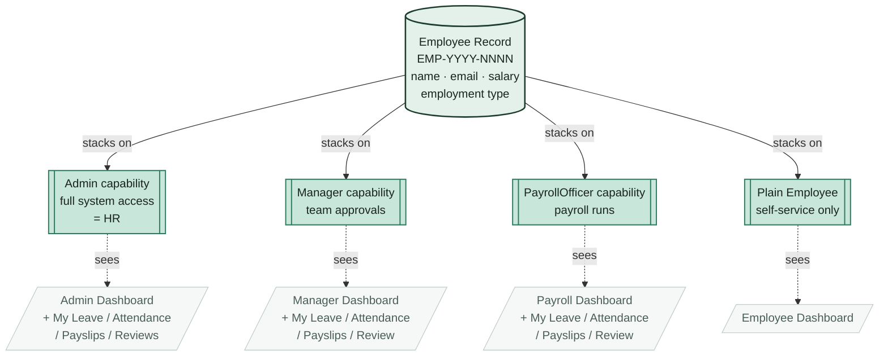

**Implication.** Admin Priya Sharma still has leave balances, attendance records, and a payslip every month. PayrollOfficer Demo User must apply for leave like anyone else. A Manager who has no reporting manager needs Admin to approve their own leave (BL-017).

---

## 2. Employee Registration & Onboarding

Only Admin can create employees. There is no self-registration (DN-01).

### 2.1 Account creation flow

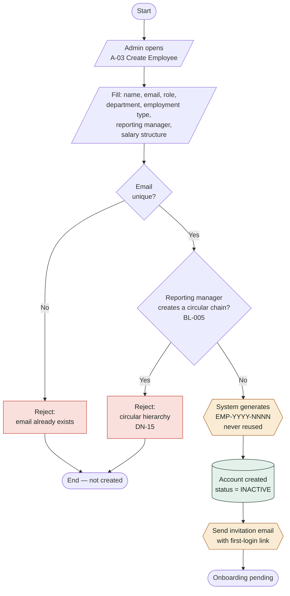

### 2.2 First-login activation

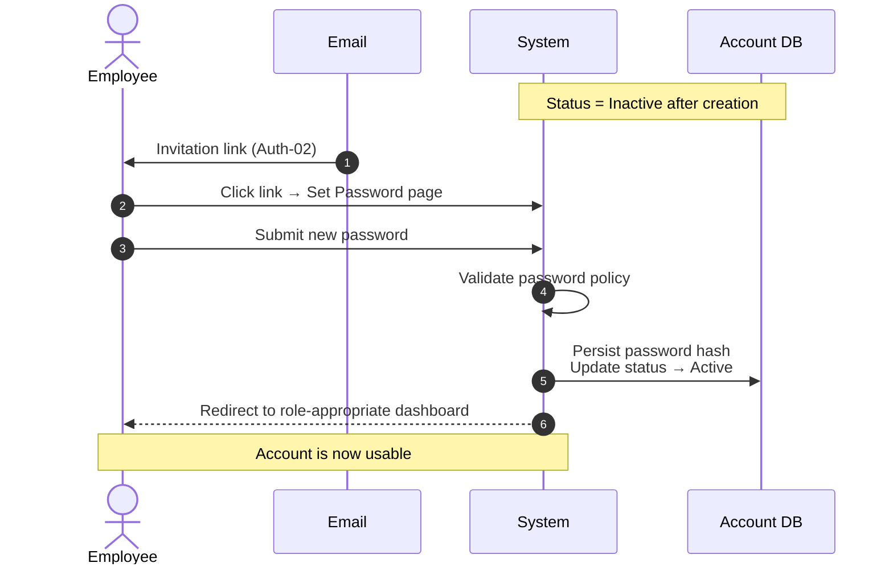

### 2.3 Employee status lifecycle

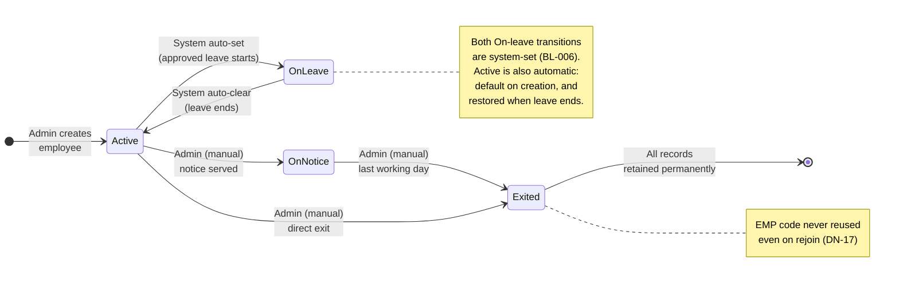

**Key rules**

| Rule | What it means |
|---|---|
| EMP code | Always `EMP-YYYY-NNNN`. Never reused — even after exit + rejoin (BL-008, DN-17). |
| Default status | `Active` on creation; `Inactive` only until first password set. |
| No circular reporting | Manager cannot directly or indirectly report to a subordinate (BL-005, DN-15). |
| Re-joiners | Get a brand-new record + new EMP code; old record preserved (BL-007/008). |

---

## 3. Daily Attendance

### 3.1 Midnight pre-generation job

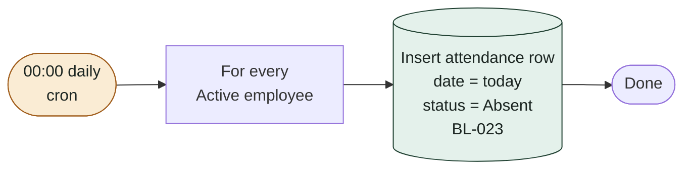

> Records are pre-generated at midnight, **not** on check-in (DN-16). Missing check-ins automatically appear as "absent" without a separate scan.

### 3.2 Status derivation cascade (BL-026)

The pre-generated row's status is overridden by the highest-priority condition that applies:

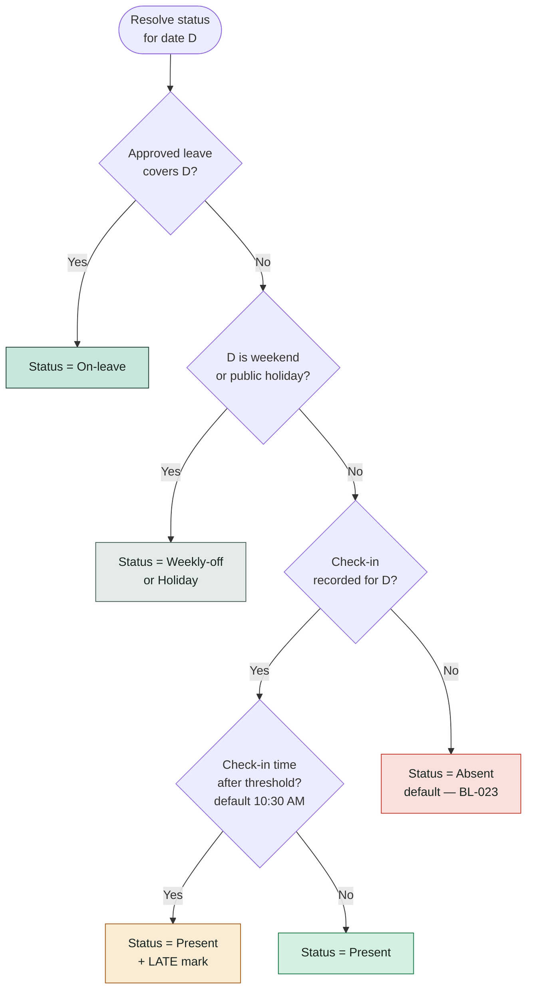

### 3.3 Check-in / Check-out (with late-mark logic)

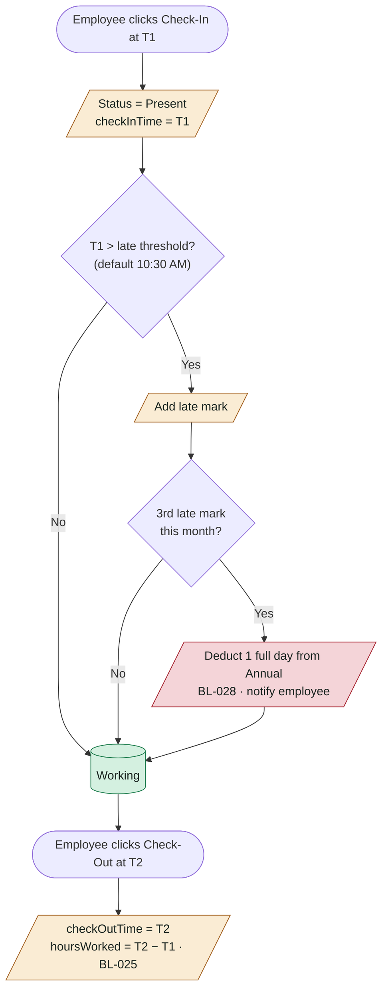

**Late penalty (BL-028)**

| Late marks in calendar month | Deduction from Annual leave |
|---|---|
| 1, 2 | none |
| 3 | **1 full day** |
| 4 | +1 full day (running total: 2) |
| 5 | +1 full day (running total: 3) |
| n (≥3) | n − 2 days |

> Half-day deductions do not exist (BL-011, DN-06).

### 3.4 Regularisation flow (correcting a past day)

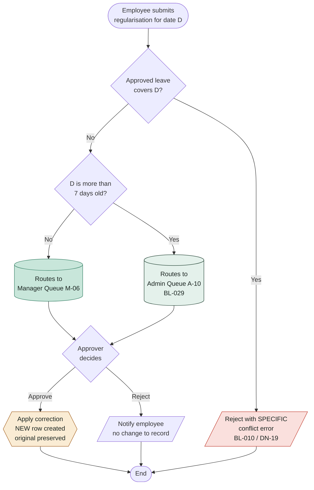

---

## 4. Leave Management

### 4.1 Leave types — at a glance

| Type | Quota model | Carry-forward (Jan 1) | Approver |
|---|---|---|---|
| Annual | Yearly, per employment type | Up to **10 days** (configurable) | Manager |
| Sick | Yearly, per employment type | **Resets to zero** (BL-012, DN-07) | Manager |
| Casual | Yearly, per employment type | Up to **5 days** (configurable) | Manager |
| Unpaid | No quota; deducted from gross pay | n/a | Manager |
| Maternity | Event-based, up to **26 weeks per event** | n/a (BL-014) | **Admin only** (BL-015) |
| Paternity | Event-based, up to **10 working days per event**, single block, within 6 months of birth | n/a (BL-014) | **Admin only** (BL-016) |

### 4.2 Apply → Validate → Route → Decide (swim-lane)

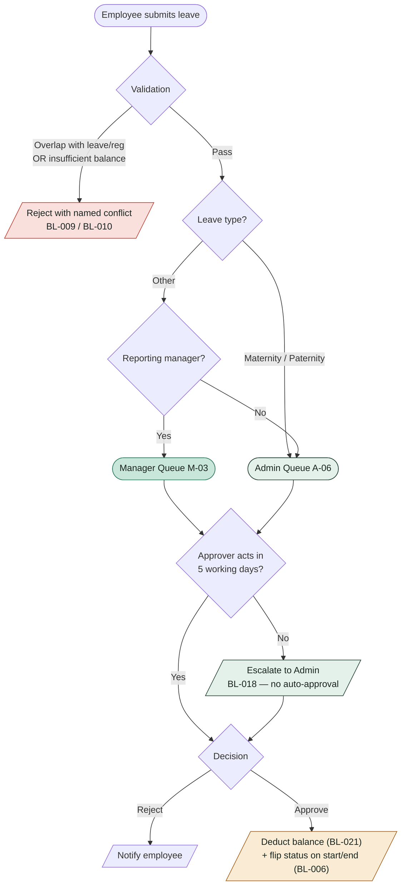

### 4.3 Cancellation rules (BL-019, BL-020)

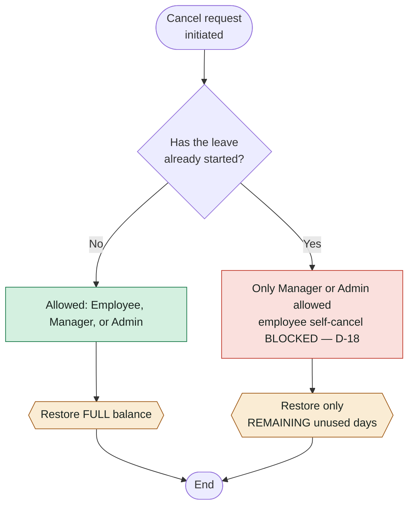

### 4.4 Annual reset on January 1

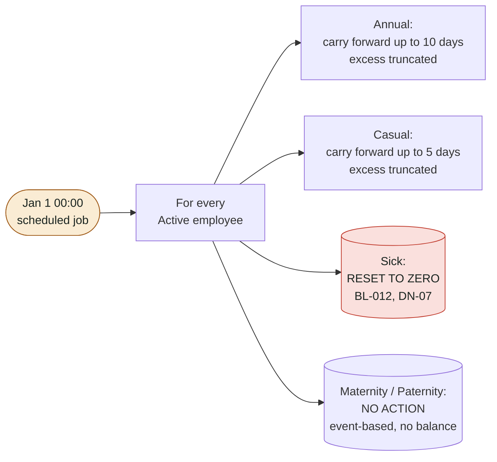

---

## 5. Monthly Payroll

Payroll runs once per month for every employee. The fiscal calendar is fixed at **April → March** (BL-002, BL-003).

### 5.1 Run state machine

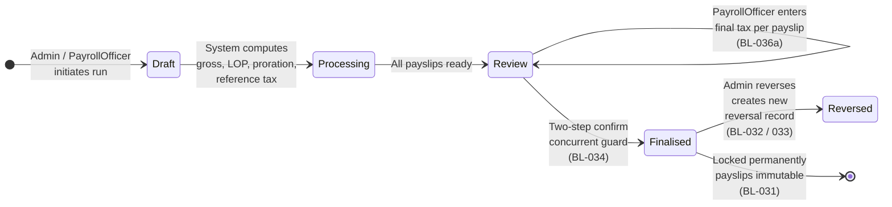

### 5.2 End-to-end run flow

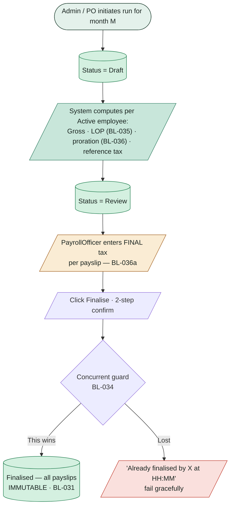

### 5.3 Manual tax entry (v1 — BL-036a)

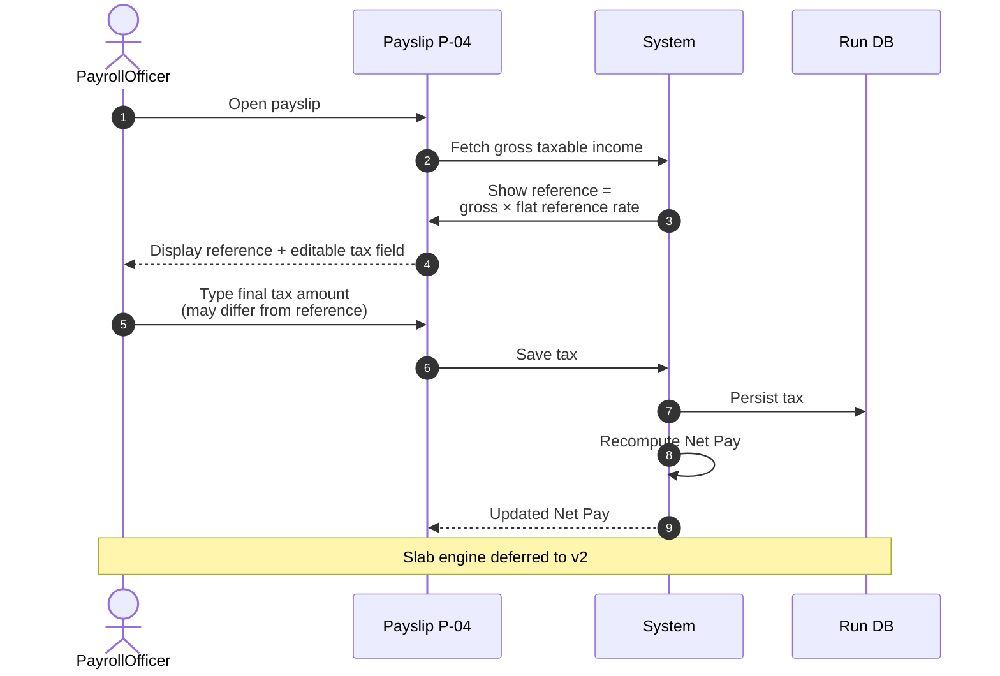

### 5.4 Reversal flow (Admin only — BL-032 / BL-033)

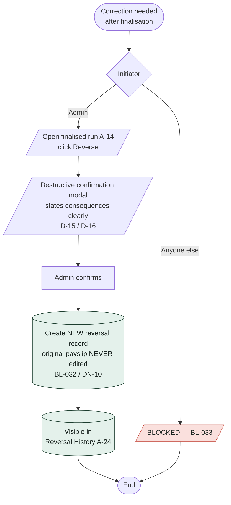

### 5.5 Salary structure changes (BL-030 / DN-11)

> Edits to an employee's salary apply from the **next** payroll run only. Already-finalised payslips remain immutable.

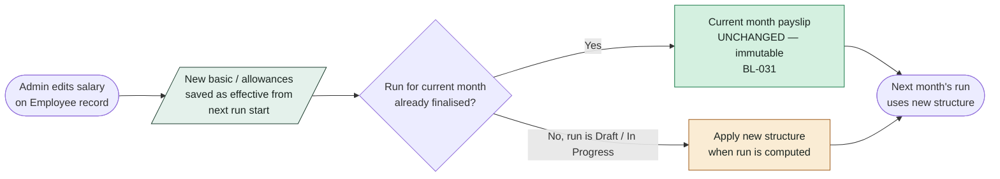

> **Never retroactive.** A mid-month raise does not regenerate or top up an already-finalised payslip; the change is visible from the next monthly run only. Adjustments for the gap (if any) are handled procedurally outside the system.

---

## 6. Performance Reviews — Half-Yearly Cycles

### 6.1 The two cycles per fiscal year

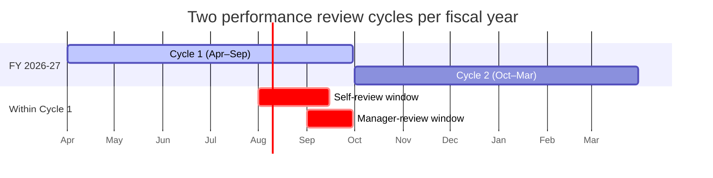

### 6.2 Cycle lifecycle (state diagram)

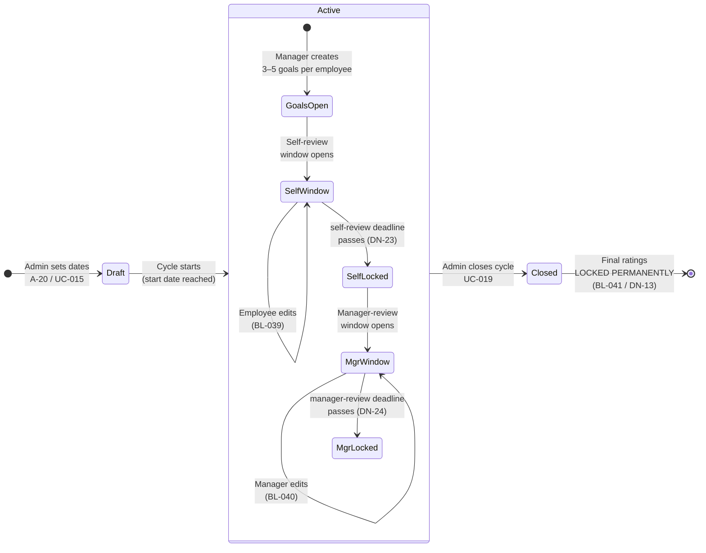

### 6.3 End-to-end cycle flow (swim-lane)

```mermaid
flowchart LR
    A1[/"Admin creates cycle<br/>(start, end, deadlines)"/]:::adm --> Skip{{"System skips mid-cycle<br/>joiners · BL-037"}}:::sys
    Skip --> M1[/"Manager sets 3–5 goals"/]:::mgr
    M1 --> E1[/"Employee submits self-rating<br/>+ may propose extra goals"/]:::emp
    E1 --> M2[/"Manager submits rating<br/>1–5 + goal scoring"/]:::mgr
    M2 --> A2[/"Admin reviews distribution<br/>+ chases missing reviews"/]:::adm
    A2 --> A3[/"Admin closes cycle"/]:::adm
    A3 --> Lock[("Final ratings LOCKED<br/>BL-041")]:::rec

    classDef adm fill:#E4F1EB,stroke:#1C3D2E,color:#1A2420;
    classDef mgr fill:#C8E6DA,stroke:#2D7A5F,color:#1A2420;
    classDef emp fill:#FAECD4,stroke:#A05C1A,color:#1A2420;
    classDef sys fill:#C8E6DA,stroke:#2D7A5F,color:#1A2420;
    classDef rec fill:#D4F0E0,stroke:#1A7A4A,color:#1A2420;
```

### 6.4 What a review captures

| Field | Filled by | Editable until |
|---|---|---|
| Goals (3–5 typical) | Manager (Employee may propose extra in self-review window) | Cycle end |
| Goal status (Met / Partial / Missed) | Manager | Cycle end |
| Self-rating + comments | Employee | Self-review deadline |
| Manager rating (1–5) + comments | Manager | Manager-review deadline |
| Final rating | Locked at cycle close (typically equal to manager rating) | Locked when Admin closes cycle |

### 6.5 Manager change mid-cycle (BL-042)

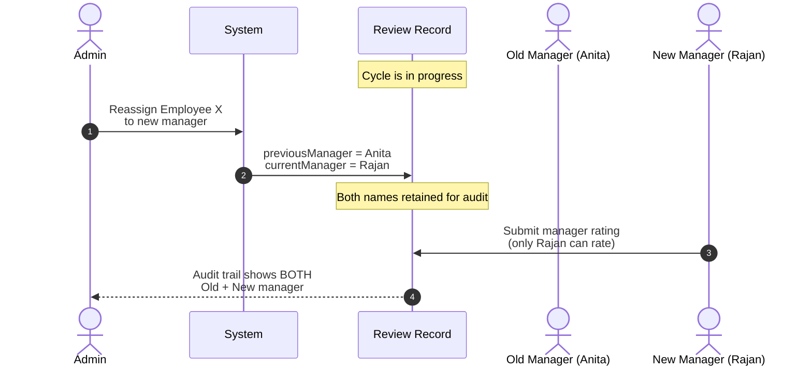

---

## 7. Admin Self-Service — How HR Handles HR

How are Admin / Manager / PayrollOfficer themselves handled? The principle: every role stacks on top of an Employee record (BL-004), so Admin Priya Sharma is an employee with the **same** flows — except where her chain rolls up to Admin itself.

### 7.0 Quick map — who handles Admin's Leave / Attendance / Payslip / Review

```mermaid
flowchart TD
    A([Admin needs to:]):::adm
    A --> L[Leave]:::adm
    A --> R[Regularisation]:::adm
    A --> P[Payslip]:::adm
    A --> V[Review]:::adm

    L --> LQ[("Admin Queue A-06<br/>peer Admin decides · BL-017")]:::adm
    R --> RAge{"Age ≤ 7 days?"}
    RAge -- Yes --> RM[Admin's manager · else Admin Queue]:::mgr
    RAge -- No --> RA[("Admin Queue A-10 · BL-029")]:::adm
    P --> PRun[("Generated in monthly run<br/>· locked when finalised")]:::pay
    V --> VHas{"Has manager?"}
    VHas -- Yes --> VM[Manager rates · §6 flow]:::mgr
    VHas -- No --> VP[Self-rate / peer Admin / exclude]:::adm

    classDef adm fill:#E4F1EB,stroke:#1C3D2E,color:#1A2420;
    classDef mgr fill:#C8E6DA,stroke:#2D7A5F,color:#1A2420;
    classDef pay fill:#D4F0E0,stroke:#1A7A4A,color:#1A2420;
```

| Flow | Who handles |
|---|---|
| **Leave** | Admin Queue → peer Admin (or self if sole Admin); audit-logged |
| **Attendance regularisation** | ≤7 days: reporting manager (if any); >7 days: Admin Queue → peer Admin |
| **Payslip** | Generated in the same monthly run; PayrollOfficer enters tax; Admin or PO finalises; locked permanently |
| **Performance review** | Reporting manager (if any) → standard §6 flow; if no manager: procedural — self / peer Admin / skip |

The detailed flows for each are in §7.1 – §7.5 below.

### 7.1 Admin's own attendance

```mermaid
flowchart LR
    A([Admin Priya logs in]) --> B[/"Same Check-In page<br/>as everyone else"/]
    B --> C[("Attendance row updated<br/>same midnight cron applies<br/>BL-023")]
    C --> D{Late mark?}
    D -- Yes --> E["Same penalty<br/>3 lates → 1 full day<br/>deducted (BL-028)"]
    D -- No --> F([End])
    E --> F
```

> No special handling. The Admin sidebar carries **My Attendance**, **My Leave**, **My Payslips**, **My Reviews** alongside admin actions. Same for Manager and PayrollOfficer.

### 7.2 Admin's leave approval

```mermaid
flowchart TD
    Start([Admin Priya<br/>submits leave]) --> Q{Priya has a<br/>reporting manager?}
    Q -- Yes --> Mgr[("Routes to that<br/>manager's queue<br/>standard flow §4.2")]:::mgr
    Q -- No — typical for Admin --> Adm[("Routes to<br/>Admin Queue A-06<br/>BL-017")]:::adm
    Adm --> Who{Who acts?}
    Who -- "Peer Admin" --> Decide
    Who -- "Self-approve (sole Admin case)" --> Decide
    Decide{{"Approve / Reject<br/>action timestamped<br/>+ initiator audit-logged"}}:::sys
    Mgr --> Decide

    classDef mgr fill:#C8E6DA,stroke:#2D7A5F,color:#1A2420;
    classDef adm fill:#E4F1EB,stroke:#1C3D2E,color:#1A2420;
    classDef sys fill:#FAECD4,stroke:#A05C1A,color:#1A2420;
```

**Why this works.** The HR team typically has multiple Admin accounts (BL-001 — HR = Admin). When Admin Priya's leave hits the queue, a peer Admin can approve it. If she's the sole Admin, she may approve her own request — but every action is timestamped and auditable (D-04 / §9.7).

### 7.3 Admin's regularisation

Same age-based routing as anyone else (BL-029):

| Days old | Routed to |
|---|---|
| ≤ 7 days | Admin's reporting Manager (if any) |
| > 7 days | Admin Queue A-10 — peer Admin acts on it |

If Admin has no reporting manager, **all** their regularisations go directly to the Admin queue.

```mermaid
flowchart TD
    Start([Admin submits regularisation<br/>for date D]) --> Age{"Age = today − D<br/>> 7 days?"}
    Age -- "No (≤ 7 days)" --> Mgr{Admin has<br/>reporting manager?}
    Age -- "Yes (> 7 days)" --> Queue["Admin Queue A-10<br/>peer Admin decides"]:::adm
    Mgr -- Yes --> RM["Mgr approves / rejects<br/>standard manager flow"]:::mgr
    Mgr -- No --> Queue
    RM --> Done([Decision recorded<br/>+ audit entry])
    Queue --> Done

    classDef mgr fill:#D4F0E0,stroke:#1A7A4A,color:#1A2420;
    classDef adm fill:#E4F1EB,stroke:#1C3D2E,color:#1A2420;
```

### 7.4 Admin's payroll

Admin's payslip is generated as part of the same monthly run as everyone else.

```mermaid
sequenceDiagram
    autonumber
    actor A as Admin (Priya)
    actor PO as PayrollOfficer
    participant SYS as System
    participant DB as Payroll DB

    Note over SYS: Monthly run covers ALL Active employees, incl. Admin
    SYS->>SYS: Compute gross, LOP, pro-ration<br/>for every employee (incl. Priya)
    PO->>SYS: Open Priya's payslip<br/>enter manual tax (BL-036a)
    SYS->>DB: Persist tax + Net Pay

    A->>SYS: Click Finalise (A-14)
    Note over SYS: Concurrent guard (BL-034)
    SYS->>DB: Lock run + ALL payslips (incl. Priya's)
    DB-->>A: Status = Finalised
    Note over A,DB: Priya's payslip is now immutable too
```

> If Admin reverses their own payslip later: technically allowed (BL-033 says Admin-only — and Admin is themselves an Admin), but it creates a **separate** reversal record (BL-032), the original is never edited, and the action shows up in Reversal History A-24 with the Admin's name. Governance on top of the system is a procedural matter, not a system rule.

### 7.5 Admin's performance review

```mermaid
flowchart TD
    Start([Cycle starts]) --> Q{Does Admin have a<br/>reporting manager?}
    Q -- Yes --> M["That manager:<br/>• creates goals<br/>• submits manager rating<br/>standard flow §6.3"]
    Q -- No, reports to no-one --> Skip{Procedural option}
    Skip --> O1[Option A:<br/>Admin self-rates only<br/>self-rating becomes final]
    Skip --> O2[Option B:<br/>Peer Admin or company head<br/>submits manager rating]
    Skip --> O3[Option C:<br/>Admin excluded from cycle<br/>by Admin choice]
    M --> Close[("Final rating LOCKED<br/>when Admin closes cycle<br/>BL-041")]
    O1 --> Close
    O2 --> Close
    O3 --> Close
```

The system itself doesn't block any of A/B/C. It enforces the deadlines and locking rules from §6.

### 7.6 PayrollOfficer's own payroll

Two safeguards:

1. **Finalise is two-eyes.** P-05 has the same two-step modal as A-14 — the PO can review their own payslip but the run is locked by the same finalise step.
2. **Concurrent guard (BL-034).** If Admin and PayrollOfficer click Finalise simultaneously, exactly one wins; the other fails gracefully.

```mermaid
flowchart LR
    Run[("Monthly run<br/>includes PO's own payslip")]:::rec --> Tax[/"PO enters manual tax<br/>on own payslip · BL-036a"/]:::po
    Tax --> Final[/"Either PO or Admin<br/>clicks Finalise · 2-step confirm"/]
    Final --> Guard{{"Concurrent guard<br/>BL-034 — one wins"}}:::sys
    Guard --> Lock[("Run + all payslips IMMUTABLE<br/>including PO's own · BL-031")]:::rec

    classDef po  fill:#FAECD4,stroke:#A05C1A,color:#1A2420;
    classDef sys fill:#C8E6DA,stroke:#2D7A5F,color:#1A2420;
    classDef rec fill:#D4F0E0,stroke:#1A7A4A,color:#1A2420;
```

### 7.7 Manager-with-no-manager — chain rolls up to Admin

| Workflow | Manager-with-no-manager flows to... |
|---|---|
| Leave approval | Admin (BL-017) |
| Regularisation > 7 days | Admin (default) |
| Regularisation ≤ 7 days | Admin (no other manager exists) |
| Performance review | Admin handles goals & rating |
| Payslip review | PayrollOfficer + Admin in monthly run |

```mermaid
flowchart TD
    M([Manager — no reporting<br/>manager configured]) --> Need{What did<br/>Mgr submit?}
    Need -- Leave request --> L["BL-017: route to Admin Queue<br/>regardless of leave type"]:::adm
    Need -- Regularisation --> R["Both ≤7 and >7 days flow<br/>to Admin Queue<br/>(no other approver exists)"]:::adm
    Need -- Performance --> P["Admin sets Mgr's goals<br/>+ submits Mgr rating §6"]:::adm
    Need -- Payslip query --> PR["PayrollOfficer in run<br/>+ Admin signs off A-14"]:::adm
    L --> Q["Admin Queue A-06 / A-10"]:::adm
    R --> Q
    P --> Done([Cycle locked when<br/>Admin closes BL-041])
    PR --> Done2([Run finalised — locked])
    Q --> Done3([Decision + audit])

    classDef adm fill:#E4F1EB,stroke:#1C3D2E,color:#1A2420;
```

> Net effect: a Manager who reports to no-one is treated by the system exactly the same as any other Employee whose chain ends at the Admin tier. Nothing falls through.

---

## 8. Edge Cases & Operational Rules

### 8.1 Manager change mid-cycle (BL-022 / D-14)

```mermaid
flowchart LR
    Reassign([Admin reassigns<br/>employee to new manager]) --> Future["Mgr B handles<br/>ALL future approvals"]:::ok
    Reassign --> Pending["Pending requests submitted<br/>BEFORE change date<br/>STAY with Mgr A"]:::warn
    Pending --> Q{Mgr A still active?}
    Q -- Yes --> Act["Mgr A approves / rejects<br/>those pending"]:::ok
    Q -- No (exited) --> Esc["Route to Admin<br/>Admin decides directly<br/>or reassigns to Mgr B"]:::adm

    classDef ok   fill:#D4F0E0,stroke:#1A7A4A,color:#1A2420;
    classDef warn fill:#FAECD4,stroke:#A05C1A,color:#1A2420;
    classDef adm  fill:#E4F1EB,stroke:#1C3D2E,color:#1A2420;
```

**Past team members are still visible to the previous manager** for audit (BL-022a). Mgr A's *My Team* screen (M-02) retains a read-only **"Past Team Members"** tab listing every employee who used to report to them — whether reassigned to another manager or exited the company — so the historical reporting line stays visible even though Mgr A can no longer act on those people's leave / attendance / reviews.

### 8.2 Concurrent finalisation (BL-034)

```mermaid
sequenceDiagram
    autonumber
    actor A as Admin
    actor P as PayrollOfficer
    participant SYS as System
    participant DB as Run DB

    par Race condition
        A->>SYS: Finalise run R
    and
        P->>SYS: Finalise run R
    end

    SYS->>DB: Acquire row-level lock on R
    DB-->>SYS: Lock acquired (one wins)
    Note over SYS: Only ONE submission proceeds
    SYS-->>A: ✓ Run finalised
    SYS-->>P: ✗ "Already finalised by<br/>Priya at 14:32:01"
```

### 8.3 Leave + regularisation conflict (BL-010 / DN-19)

The system rejects the **second** submission with a **specific** conflict error message — never a generic validation error. Example:

> *"An approved Annual Leave (L-2026-0118) already covers 28 May 2026. You cannot regularise a date already taken as approved leave. Cancel the leave first if the record needs correcting."*

```mermaid
flowchart TD
    Sub([User submits Leave OR Regularisation<br/>for date D]) --> Check{Existing record on D?}
    Check -- "None" --> OK[/"Accept submission<br/>continue normal flow"/]:::ok
    Check -- "Approved Leave on D" --> EReg{"Submission is<br/>regularisation?"}
    Check -- "Pending/Approved Reg on D" --> ELeave{"Submission is<br/>leave?"}

    EReg -- Yes --> RegBlock["BLOCK with NAMED conflict:<br/>'Approved leave L-… already covers D.<br/>Cancel the leave first.'"]:::err
    EReg -- No --> OK
    ELeave -- Yes --> LeaveBlock["BLOCK with NAMED conflict:<br/>'Regularisation R-… already covers D.<br/>Resolve the regularisation first.'"]:::err
    ELeave -- No --> OK

    RegBlock --> Cancel{User cancels<br/>existing leave?}
    Cancel -- Yes --> ReSub([Re-submit regularisation])
    Cancel -- No --> Stop([No action — D unchanged])
    LeaveBlock --> Stop

    classDef ok  fill:#D4F0E0,stroke:#1A7A4A,color:#1A2420;
    classDef err fill:#F4D4D8,stroke:#A41E2A,color:#1A2420;
```

> The error message **always** names the conflicting record by ID so the user knows exactly which leave / regularisation to deal with first.

### 8.4 Re-joining after exit (BL-008 / DN-17)

```mermaid
flowchart LR
    A[("Employee exits<br/>EMP-2024-0042")]:::rec --> B[("Old record retained<br/>with full history<br/>BL-007 / DN-25")]:::rec
    B --> C([Years later, rejoin]) --> D[("NEW record:<br/>EMP-2027-0312")]:::rec
    D --> E[("Old record stays<br/>code 0042 NEVER reused")]:::rec

    classDef rec fill:#E4F1EB,stroke:#1C3D2E,color:#1A2420;
```

### 8.5 No half-day leave (BL-011 / DN-06)

All leave is full-day units only. Late-mark penalties also deduct full days, never half-days.

### 8.6 Audit and historical data (BL-047 / BL-048 / D-01 / §9.7)

| What | Rule |
|---|---|
| Payslips | Immutable once finalised. Never deleted. |
| Attendance corrections | Original record preserved; correction added as new entry. |
| Reversals | New reversal record; original payslip untouched. |
| Manager changes (review) | Both old and new manager recorded. |
| Exited employees | All records retained permanently. |
| Audit log entries | **System-generated and append-only.** No user — Admin included — can edit or delete an entry. |
| Audit coverage | Spans every module: user/hierarchy changes, leave decisions, attendance corrections, payroll runs and reversals, review-cycle actions. |

> Every action produces a traceable audit record with user, timestamp, and action type (§9.7). See §11 for the full audit-write flow.

---

## 9. Notifications

Every role has a dedicated `notifications.html` feed that is **role-scoped** — admins, managers, employees, and payroll officers each see only the events relevant to them. Notifications are not opt-in: they are a side-effect of system events.

### 9.1 Notification generation flow

```mermaid
flowchart LR
    Event([System event]) --> Resolve[/"Pick recipients<br/>by event type"/]:::sys
    Resolve --> Persist[(Persist notification<br/>+ link to source record)]:::rec
    Persist --> Bell["Header bell shows red dot<br/>until feed opened"]:::ok
    Persist -.-> Retain{{"Retained 90 days<br/>then archived"}}:::sys

    classDef sys fill:#FAECD4,stroke:#A05C1A,color:#1A2420;
    classDef rec fill:#E4F1EB,stroke:#1C3D2E,color:#1A2420;
    classDef ok  fill:#D4F0E0,stroke:#1A7A4A,color:#1A2420;
```

The "pick recipients by event type" step uses this lookup:

| Trigger | Recipient(s) |
|---|---|
| Leave submitted | Reporting manager (or Admin if none) |
| Leave approved / rejected / cancelled | Requesting employee |
| 5-day timeout (BL-018) | Admin (also auto-escalates) |
| Regularisation submitted | Manager (≤7 d) or Admin (>7 d) — BL-029 |
| Regularisation actioned | Employee |
| Late mark · 2nd in month | Employee — warning |
| Late mark · 3rd+ in month | Employee — penalty applied |
| Payroll run state change | PayrollOfficer + Admin |
| Payslip finalised | Employee |
| Payslip reversed | Affected employee + Admin |
| Cycle opened / closed | Managers + employees in scope |
| Self-review window 7 d / 1 d before deadline | Employee |
| Manager-review window 7 d / 1 d before deadline | Manager |
| Status change (Active / On-Notice / Exited / On-Leave) | Employee + Admin |
| Carry-forward applied (Jan 1) | Employee |
| Configuration change (A-19 / A-20) | All Admins |

### 9.2 Per-role coverage

| Role | What they see |
|---|---|
| **Employee** | Leave-status updates, late-mark warnings, payslip-ready, self-review windows, regularisation outcomes, carry-forward applied, status changes |
| **Manager** | Pending team approvals, review-deadline reminders, today's team-on-leave summary, escalations from their team |
| **Admin** | Escalations (BL-018), finalisation prompts, reversal events, configuration changes, status changes across the org |
| **PayrollOfficer** | Run finalisation prompts, tax-rate updates, LOP anomalies, reversal events affecting payroll |

### 9.3 Retention

Notifications retain for **90 days**. Audit-relevant events (approvals, payroll runs, reversals, status changes) are kept permanently in the audit log — see §11.

---

## 10. Account Access — First Login & Forgot Password

Two flows govern how a user gets into the system.

### 10.1 First login (post-creation)

```mermaid
flowchart TD
    Create([Admin creates employee · D-02]):::adm --> Mail[/"System emails temp credentials<br/>+ first-login link"/]:::sys
    Mail --> Visit([Employee opens first-login page])
    Visit --> Try[/"Enter temp credentials"/]
    Try --> V{Valid?}
    V -- No --> Retry[/"Reject · increment counter<br/>5 wrong = 15 min lockout"/]:::err
    V -- Yes --> Reset[/"Force password reset<br/>(≥8 chars, mixed)"/]:::sys
    Reset --> Save[("Hash · persist · clear temp flag")]:::rec
    Save --> Dash([Redirect to role dashboard]):::ok

    classDef adm fill:#E4F1EB,stroke:#1C3D2E,color:#1A2420;
    classDef sys fill:#FAECD4,stroke:#A05C1A,color:#1A2420;
    classDef err fill:#F4D4D8,stroke:#A41E2A,color:#1A2420;
    classDef rec fill:#E4F1EB,stroke:#1C3D2E,color:#1A2420;
    classDef ok  fill:#D4F0E0,stroke:#1A7A4A,color:#1A2420;
```

### 10.2 Forgot password / account recovery

```mermaid
flowchart TD
    Start([User clicks 'Forgot password']) --> Form[/"Enter registered email<br/>or EMP code"/]
    Form --> Submit{System finds<br/>active user?}
    Submit -- No --> Generic["Show GENERIC success message:<br/>'If an account exists, an email was sent'<br/>(no enumeration leak)"]:::ok
    Submit -- Yes --> Token[("Generate single-use token<br/>+ 30 min expiry")]:::sys
    Token --> Mail["Email reset link to<br/>user's registered address"]:::sys
    Mail --> Click([User clicks link])
    Click --> Valid{Token valid<br/>+ unexpired?}
    Valid -- No --> Expired["Show: 'Link expired —<br/>request a new one'"]:::err
    Valid -- Yes --> Reset[/"New password form<br/>(≥8 chars, not last 3)"/]
    Reset --> Save[("Hash + persist<br/>invalidate token<br/>invalidate active sessions")]:::rec
    Save --> Login([Redirect to login])

    classDef ok  fill:#D4F0E0,stroke:#1A7A4A,color:#1A2420;
    classDef sys fill:#FAECD4,stroke:#A05C1A,color:#1A2420;
    classDef err fill:#F4D4D8,stroke:#A41E2A,color:#1A2420;
    classDef rec fill:#E4F1EB,stroke:#1C3D2E,color:#1A2420;
```

> **Security choices.** The "we always show success" branch on a missing account prevents account enumeration. Tokens expire in 30 min and are single-use. A successful reset invalidates all active sessions for that user (forces re-login on every device).

---

## 11. Audit Log

Per BL-047 / BL-048, every state-changing action in the system writes an immutable audit entry. Admins can read the log via A-26, but **no user — including Admin — can edit or delete entries**.

### 11.1 Audit write flow

```mermaid
flowchart LR
    A([Any state-changing<br/>action in any module]) --> Hook{Captured by<br/>audit hook}
    Hook --> Build[/"Build entry:<br/>• actor (user, role, IP)<br/>• timestamp<br/>• action type<br/>• target record (id, module)<br/>• before / after snapshot"/]
    Build --> Persist[(Append to<br/>audit_log table<br/>append-only)]:::rec
    Persist --> Index["Index by: actor, target,<br/>timestamp, module"]:::sys
    Index --> Read["A-26 Audit Log page<br/>read-only view + filters"]:::adm
    Persist -.-> NoEdit{{"DB constraint:<br/>UPDATE / DELETE<br/>denied — even Admin"}}:::err

    classDef rec fill:#E4F1EB,stroke:#1C3D2E,color:#1A2420;
    classDef sys fill:#FAECD4,stroke:#A05C1A,color:#1A2420;
    classDef adm fill:#E4F1EB,stroke:#1C3D2E,color:#1A2420;
    classDef err fill:#F4D4D8,stroke:#A41E2A,color:#1A2420;
```

### 11.2 What gets logged

| Module | Actions captured |
|---|---|
| User & hierarchy | Create / activate / deactivate employee, change role, change reporting manager, status change (Active / On-Notice / Exited / On-Leave) |
| Leave | Submit, approve, reject, cancel, escalate, balance adjustment (carry-forward, late penalty) |
| Attendance | Check-in, check-out, late mark, regularisation submit / approve / reject |
| Payroll | Run create, compute, lock, finalise, reverse, manual tax entry, salary structure edit |
| Performance | Cycle open / close, goal create / edit, self-rating submit, manager rating submit, manager change mid-cycle |
| Configuration | Late threshold change (A-19), standard daily hours change (A-19 / BL-025a), holiday calendar edit, leave-policy edit, escalation timeout change |
| Authentication | Login success / failure, password reset, lockout, session invalidation |

### 11.3 Why correction events are recorded as new entries (not edits)

For attendance regularisations and payroll reversals, the **original** record is never mutated. Instead the system writes a separate correction / reversal record and links the two via the audit log. This preserves a complete history without losing any prior state.

```mermaid
flowchart LR
    Orig[("Original record<br/>e.g. payslip P-2026-04")] -->|"audit: 'reversed by'"| Rev[("New reversal record<br/>P-2026-04-R1")]:::rec
    Orig -. "never mutated<br/>BL-031 / BL-032" .- Lock{{Immutable}}:::ok

    classDef rec fill:#E4F1EB,stroke:#1C3D2E,color:#1A2420;
    classDef ok  fill:#D4F0E0,stroke:#1A7A4A,color:#1A2420;
```

---

## Appendix — Approver Cheat-Sheet

| Process | Standard approver | Special cases |
|---|---|---|
| Annual / Sick / Casual / Unpaid leave | Reporting Manager | No-manager → Admin · 5-day timeout → Admin (BL-018) |
| Maternity leave | **Admin only** | — (BL-015) |
| Paternity leave | **Admin only** | — (BL-016) |
| Regularisation ≤ 7 days | Reporting Manager | No-manager → Admin |
| Regularisation > 7 days | **Admin only** | — (BL-029) |
| Payroll finalisation | Admin or PayrollOfficer | Concurrent guard (BL-034) |
| Payroll reversal | **Admin only** | Always creates a new reversal record (BL-032 / 033) |
| Cycle creation / closure | **Admin only** | — |
| Goal-setting | Reporting Manager | Employee may propose during self-review window (BL-038) |
| Manager rating | Reporting Manager | Manager-change mid-cycle: new manager rates; both recorded (BL-042) |

---

*See [SRS_HRMS_Nexora.md](./SRS_HRMS_Nexora.md) for full requirements and rule IDs (BL-xxx / DN-xxx / D-xx).*
